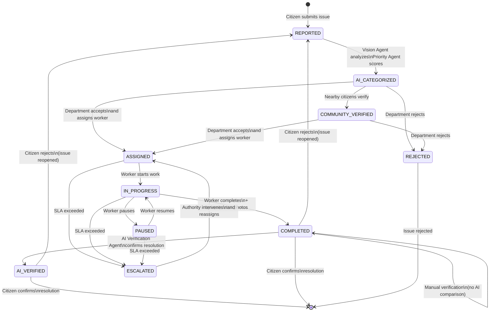

# Complaint Lifecycle — Community Hero

## Overview

Every civic grievance in Community Hero progresses through a well-defined lifecycle. The system tracks each status transition as a timeline event, providing full auditability. Multiple actors — citizens, AI agents, departments, workers, and administrators — interact at different stages.

---

## State Transition Diagram



---

## Complete Lifecycle Flow

### Stage 1: Citizen Reports (→ `reported`)

**Actor:** Citizen
**Trigger:** Citizen submits issue via the Report form (`/report`)

The citizen provides:
- **Title** — Brief description
- **Description** — Detailed explanation
- **Category** — From predefined list (pothole, garbage, water leakage, etc.)
- **Severity** — Critical, medium, or low
- **Location** — Map pin drop or current location via geolocation
- **Photos (optional)** — Uploaded via file picker or camera

**System Actions:**
1. [Client] Optional: Vision Agent pre-analyzes photo → suggests category, severity, hazards
2. [Client] Optional: Duplicate Agent checks for existing nearby reports
3. [Client] Citizen confirms or adjusts AI suggestions
4. [Client] Form submitted to `POST /api/issues`

**Result:** Issue created with `status: "reported"` and first timeline entry.

### Stage 2: AI Categorization (→ `ai_categorized`)

**Actor:** AI System (automatically)
**Trigger:** Issue creation in `createNewIssue()` controller

The system executes a pipeline of AI agents:

**1. Media Upload**
```
If photos provided → Upload to Firebase Storage
                    → Store URLs in issue.mediaUrls
```

**2. Location Analysis**
```
LocationAgent.analyzeLocation(lat, lng)
  ├─ Reverse geocode (Google Maps Geocoding API)
  ├─ Resolve ward from KMC ward catalog
  ├─ Detect nearby landmarks (Google Maps Places API)
  └─ Result: { address, ward, wardNumber, borough, landmark, nearbyPlaces }
```

**3. Duplicate Check**
```
DuplicateAgent.findDuplicates({ lat, lng, category, title, description })
  ├─ Fetch open issues within 500m radius
  ├─ Compute text similarity (Jaccard index)
  ├─ Score: category(0.4) + title(0.3) + description(0.3) + proximity(0.2)
  └─ If threshold > 0.7 → Return 409 Conflict with duplicate details
```

**4. Priority Calculation**
```
PriorityAgent.calculatePriority({
  category, severity, supportCount, verificationScore, location
})
  ├─ Base score: severity(40/25/10) + category(15/12/10/...) + support + verification
  ├─ Age bonus: >72h(+10), >24h(+5)
  ├─ Proximity bonus: near hospital(+15), near school(+10)
  ├─ AI refinement: Groq Llama 3.3 evaluates context
  └─ Result: { priority: "critical"|"medium"|"low", score, reasoning }
```

**5. AI Summary Generation**
```
generateText(SUMMARY_PROMPT + issue details)
  ├─ Groq Llama 3.3 generates concise summary
  └─ Fallback: "{category} issue reported: {title}"
```

**6. Notification**
```
NotificationAgent.notifyIssueReported(issue)
  ├─ Notify all authority and admin users
  ├─ Notify department-specific users
  └─ Create notification documents in Firestore
```

**7. Gamification**
```
addPoints(reporterId, PointAction.REPORT)  // +10 points
```

**Result:** Issue status advances to `"ai_categorized"` with priority, summary, and enriched location data.

### Stage 3: Community Verification (→ `community_verified`)

**Actor:** Nearby citizens / volunteers
**Trigger:** Other users verify issue existence

**Flow:**
1. Nearby users receive notification: "Please verify: {issue.title} near you"
2. Users visit issue detail page → view location + photos
3. Users submit verification via `POST /api/verification/:issueId`
4. Verification is stored in `verifications` collection

**Verification Statuses:**
- `confirmed` — User confirms issue exists
- `rejected` — User reports issue does not exist
- `pending` — Initial state

**Result:** When sufficient verifications accumulate, status advances to `"community_verified"`. (This step is optional for the lifecycle — issues can proceed directly from `ai_categorized` to `assigned`.)

### Stage 4: Department Assignment (→ `assigned`)

**Actor:** Department Officer
**Trigger:** Officer reviews and accepts the issue

**Department Officer Actions:**
1. View department dashboard (`GET /api/department`)
2. Review issue details, photos, AI analysis, similar issues
3. **Accept** — Issue enters department's active queue
4. **Reject** — Issue rejected with reason
5. **Defer** — (Future scope) Assign to different department

**Assignment:**
```
departmentController.departmentAction({ action: 'accept' })
  ├─ status → "assigned"
  ├─ Add timeline event: "Accepted"
  └─ Issue now visible in department's "accepted" queue
```

**Assign to Worker:**
```
departmentController.departmentAction({ action: 'assign', assignedTo: 'workerUID', assignedWorkerName: 'Name' })
  ├─ status → "assigned" (with worker assignment)
  ├─ updates.assignedTo = workerUID
  ├─ Add timeline event: "Assigned to Worker"
  ├─ NotificationAgent.notifyIssueAssigned(issue, workerUID)
  │   ├─ Notify reporter: "Your issue has been assigned to a worker"
  │   └─ Notify worker: "You have been assigned: {issue.title}"
  └─ Issue appears in worker's task list
```

**Result:** Issue is assigned to a specific field worker. Both the citizen and worker receive notifications.

### Stage 5: Work In Progress (→ `in_progress` → `paused`)

**Actor:** Field Worker
**Trigger:** Worker begins field work

**Worker Actions:**
```
workerController.workerUpdateTask({ action: 'start' })
  ├─ status → "in_progress"
  ├─ Optionally upload "before" photos
  │   ├─ POST /api/worker/tasks/:id/images (type="before")
  │   └─ Photos stored in issue.beforeImages
  ├─ Add timeline event: "Work Started"
  └─ NotificationAgent.notifyWorkStarted(issue) → notify citizen
```

**Pause/Resume:**
```
workerController.workerUpdateTask({ action: 'pause' })
  ├─ status → "paused"
  └─ Add timeline event: "Work Paused"
```

**Result:** Worker is actively resolving the issue. Citizen is notified when work starts.

### Stage 6: Completion & AI Verification (→ `completed` → `ai_verified`)

**Actor:** Field Worker + AI System
**Trigger:** Worker marks task complete with after-photos

**Worker Completion:**
```
workerController.workerUpdateTask({ action: 'complete', notes: 'Fixed the pothole' })
  ├─ status → "completed"
  ├─ Upload "after" photos:
  │   POST /api/worker/tasks/:id/images (type="after")
  │   ├─ Photos stored in issue.afterImages
  │   │
  │   └─ AI Trigger (automatic when type="after"):
  │       VerificationAgent.verifyCompletionFromUrls(beforeUrl, afterUrl)
  │         ├─ Download before/after images
  │         ├─ Groq Llama 4 Scout compares images
  │         ├─ Result:
  │         │   "resolved"              → status → "ai_verified"
  │         │   "possibly_unresolved"   → needs manual review
  │         │   "need_manual_review"    → human inspector needed
  │         └─ Update resolutionStatus + aiResolutionConfidence
  │
  ├─ Add timeline event: "Work Completed"
  ├─ GamificationService.awardResolutionPoints(workerUID)  // +20 points
  └─ NotificationAgent.notifyIssueResolved(issue)
      └─ Notify citizen: "Your issue has been marked as resolved. Please confirm."
```

**SLA Check:** The escalation service runs every 15 minutes and auto-escalates issues that exceed SLA thresholds:
- Critical: 24 hours
- Medium: 72 hours
- Low: 168 hours

**Result:** Issue resolved with AI verification confidence score. Citizen is asked to confirm.

### Stage 7: Citizen Confirmation (→ Closure or Reopen)

**Actor:** Citizen (original reporter)
**Trigger:** Citizen reviews the resolved issue

**Citizen Actions:**
```
citizenConfirmResolution(req, res, next)
  POST /api/issues/:id/confirm
  Body: { confirmed: true, comment: "The pothole is fixed. Thank you!" }
```

**If Confirmed (`citizenConfirmed: true`):**
```
  ├─ Issue status remains "ai_verified" or "completed"
  ├─ Citizen satisfaction recorded in analytics
  ├─ Issue marked as resolved
  └─ Citizen earns points
```

**If Rejected (`citizenConfirmed: false`):**
```
  ├─ Issue status → "reported" (reopened)
  ├─ Issue reappears in department queue
  ├─ NotificationAgent.notifyIssueReopened(issue)
  │   ├─ Notify department
  │   └─ Notify authority
  └─ Timeline event: "Issue Reopened — citizen feedback: {comment}"
```

**Result:** Issue is either closed (confirmed) or returned to the active queue (rejected).

### Stage 8: Analytics Integration

Throughout the lifecycle, all status changes feed into the analytics engine:

| Event | Analytics Impact |
|-------|-----------------|
| Issue created | Increments `totalIssues`, updates `issueTrends` |
| Status change | Updates status distribution counts |
| Issue resolved | Increments `resolvedIssues`, updates `resolutionRate`, computes `avgRepairTimeHours` |
| Citizen confirmed | Updates `citizenSatisfaction` score |
| Worker completed | Updates `departmentPerformance` metrics |
| Issue escalated | Records in `wardMetrics.escalatedCount` |
| Issue rejected | Updates rejection statistics |

---

## Timeline Visualization

Each issue maintains a `timeline` array that records every status transition:

```json
"timeline": [
  {
    "status": "reported",
    "label": "Reported",
    "timestamp": "2025-01-01T10:00:00.000Z"
  },
  {
    "status": "ai_categorized",
    "label": "AI Categorized",
    "description": "Priority: critical. Large pothole on main road near school.",
    "timestamp": "2025-01-01T10:00:01.000Z"
  },
  {
    "status": "assigned",
    "label": "Assigned to Worker",
    "description": "Assigned to Rajesh Kumar",
    "actor": "Public Works Officer",
    "timestamp": "2025-01-01T14:30:00.000Z"
  },
  {
    "status": "in_progress",
    "label": "Work Started",
    "actor": "Rajesh Kumar",
    "timestamp": "2025-01-02T09:00:00.000Z"
  },
  {
    "status": "completed",
    "label": "Work Completed",
    "description": "Pothole filled and road surface repaired",
    "actor": "Rajesh Kumar",
    "timestamp": "2025-01-02T16:00:00.000Z"
  },
  {
    "status": "ai_verified",
    "label": "AI Verified",
    "description": "AI confirms resolution with 88% confidence",
    "timestamp": "2025-01-02T16:00:05.000Z"
  }
]
```

The timeline is rendered in the frontend `IssueTimeline` component, showing each step with icons and actor names.

---

## Escalation Path

Issues that exceed SLA thresholds without resolution follow the escalation path:

```
Every 15 minutes:
  checkAndEscalateIssues()
    ├─ Fetch all active issues
    ├─ For each issue:
    │   ├─ Calculate hours since created
    │   ├─ Compare against SLA_HOURS[priority]:
    │   │   critical: 24h, medium: 72h, low: 168h
    │   ├─ If over SLA:
    │   │   ├─ status → "escalated"
    │   │   ├─ escalationLevel += 1
    │   │   ├─ escalationHistory.push({ level, reason, timestamp })
    │   │   ├─ Add timeline event: "Escalated"
    │   │   └─ NotificationAgent.notifyIssueEscalated(issue)
    │   │       ├─ Notify authority + admin
    │   │       └─ Notify department
    │   └─ If within SLA: skip
    └─ Return list of escalated issue IDs
```

Escalated issues require authority intervention to reassign or fast-track.

---

## Lifecycle Summary Table

| Stage | Status | Actor | System Actions |
|-------|--------|-------|----------------|
| 1 | `reported` | Citizen | Store issue, trigger AI pipeline |
| 2 | `ai_categorized` | AI | Vision analysis, location enrichment, priority calc, summary, notifications |
| 3 | `community_verified` | Citizens | Store verification records |
| 4 | `assigned` | Department | Assign worker, notify reporter + worker |
| 5 | `in_progress` | Worker | Upload before-photos, notify citizen |
| 6 | `completed` / `ai_verified` | Worker + AI | Upload after-photos, AI verification, points, notify citizen |
| 7 | Closure | Citizen | Confirm or reject resolution |
| 8 | Analytics | System | Update all metrics |

---

## Actor Responsibilities

```
                    COMPLAINT LIFECYCLE
                    ===================

CITIZEN ─────► REPORT ──► CONFIRM CLOSURE
                │                  ▲
                │                  │
                ▼                  │
DEPARTMENT ──► ACCEPT ──► ASSIGN ──┤
                              │     │
                              ▼     │
WORKER ──────► START ──► COMPLETE ──┤
                │              │     │
                ▼              ▼     │
AI SYSTEM ──► CATEGORIZE ──► VERIFY ─┘
                │                    
                ▼                    
ESCALATION ──► AUTO-ESCALATE (if SLA exceeded)